# AI Canvas 项目架构学习文档

> 面向：**React + Konva + Zustand + FastAPI** 全栈维护者。  
> 目标：系统理解定位、数据流、坐标、**画布 AI 节点工作流**与单步生图链路，并能安全扩展。

---

## 目录

1. [项目定位](#1-项目定位)
2. [技术栈](#2-技术栈)
3. [仓库目录结构](#3-仓库目录结构)
4. [核心数据模型](#4-核心数据模型)
5. [Zustand 状态管理](#5-zustand-状态管理)
6. [React 组件职责](#6-react-组件职责)
7. [画布坐标系统](#7-画布坐标系统)
8. [图片裁剪](#8-图片裁剪)
9. [AI 蒙版](#9-ai-蒙版)
10. [AI 生图调用流程](#10-ai-生图调用流程)
11. [Python 后端](#11-python-后端)
12. [OSS 上传](#12-oss-上传)
13. [保存与加载 JSON / localStorage](#13-保存与加载-json--localstorage)
14. [典型用户操作数据流](#14-典型用户操作数据流)
15. [容易混淆的问题](#15-容易混淆的问题)
16. [如何扩展](#16-如何扩展)
17. [画布 AI 节点工作流（当前实现）](#17-画布-ai-节点工作流当前实现)

---

## 1. 项目定位

| 维度 | 说明 |
|------|------|
| **产品形态** | 浏览器内的 **可视化画布编辑器**（类 Figma 的简化版）：多页面、图层、选择/变换、对齐、组合、小地图、素材库。 |
| **差异化能力** | ① **单步 AI 弹窗**：生图 / 图生图 / 局部重绘（inpaint），`ImageElement` + 笔刷蒙版 → FastAPI → OSS → 多模型网关。② **同一画布上的 AI 节点图**：`Page.aiNodes` + `Page.edges`，端口连线、逐节点运行（`POST /api/workflow/run-node`）或纯前端同步类节点。 |
| **数据真相源** | 前端 **Zustand + Immer** 持有的 `pages[]`（每页含 `elements`、`aiNodes`、`edges`）；持久化以 **localStorage**（防抖 + 配额保护）为主，另支持 **导出/导入 `ProjectJSON`** 与 **远程 save/load**（自备契约）。 |
| **运行时** | `npm run dev` 通过 **concurrently** 同时起 **Vite（5173）** 与 **uvicorn（默认 13555）**；Vite 将 `/api` **代理**到后端，避免 CORS 与端口混用问题。 |

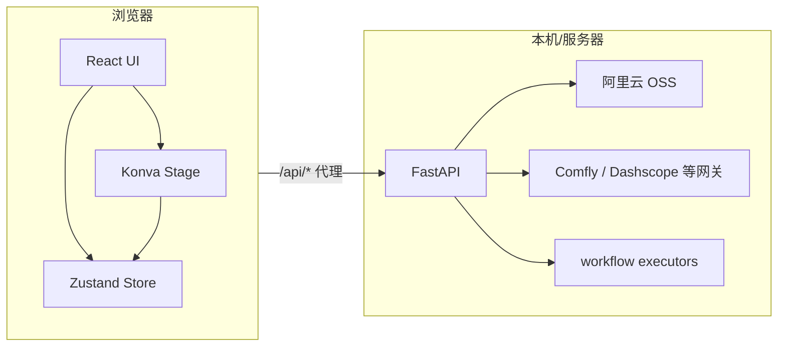

---

## 2. 技术栈

### 2.1 前端

| 技术 | 版本（参考 `package.json`） | 用途 |
|------|---------------------------|------|
| React | 19.x | UI 与状态订阅 |
| TypeScript | ~5.6 | 类型安全 |
| Vite | 6.x | 开发与构建；`/api` 代理 |
| Konva / react-konva | 9.x / 19.x | 2D 画布、变换器、滤镜、裁剪预览、**工作流节点 Konva 视图** |
| Zustand | 5.x | 全局编辑器状态 |
| Immer (`produce`) | 10.x | 不可变式深层更新 |
| nanoid | 5.x | id 生成 |

### 2.2 后端

| 技术 | 用途 |
|------|------|
| FastAPI | HTTP API：`/api/health`、`/api/models`、`/api/upload-image-url`、`/api/generate-image`、**`/api/workflow/run-node`** |
| httpx | 同步 HTTP 客户端，调用外部图生图网关（带重试） |
| dashscope | 通义 Qwen 等调用路径 |
| alibabacloud-oss-v2 | 将 dataURL 上传 OSS，返回公网 URL |
| Pillow | 图像辅助（如豆包尺寸计算） |
| uvicorn | ASGI 服务 |

---

## 3. 仓库目录结构

| 路径 | 职责 |
|------|------|
| `src/main.tsx` | React 入口 |
| `src/App.tsx` | 应用壳：顶栏、侧栏、模态框开关、`stageRef`、导入导出入口 |
| `src/components/StageCanvas.tsx` | **主画布**：`Stage` + **3 个 `Layer`**（背景网格与边、元素+端口+AI 节点、对齐线/框选/Transformer/临时连线）；元素与 **工作流连线/端口** 事件 |
| `src/components/workflow/WorkflowNodeView.tsx` | 单个 **AI 功能节点** 的 Konva 表现（预览、端口、运行条、拖拽） |
| `src/components/FloatingToolbar.tsx` | 选中元素上方的 **快捷工具条**（Portal + 世界坐标 AABB） |
| `src/components/CropEditorModal.tsx` | **裁剪编辑器**（独立 Konva 场景，写回 `cropOffset*` / `cropScale` / `cropRotation` / flip） |
| `src/components/MaskEditorModal.tsx` | **AI 蒙版笔刷**编辑器，写回 `aiMask` |
| `src/components/AiGenerateModal.tsx` | **单步 AI 生图**：组装 payload → `POST /api/generate-image` → 新图层或替换 |
| `src/components/AiChatPanel.tsx` | 侧栏 AI 对话/附件（与画布松耦合） |
| `src/components/LibraryPanel.tsx` | 素材库 |
| `src/components/MiniMap.tsx` | 小地图导航 |
| `src/components/ContextMenu.tsx` | 右键菜单 |
| `src/components/QuickToolbarSettings.tsx` | 快捷条按钮配置 |
| `src/workflow/types.ts` | **工作流类型**：`WorkflowNode`、`NodeEdge`、`NodeEndpoint`、`WorkflowNodeDefinition` 等 |
| `src/workflow/nodeRegistry.ts` | 节点类型 **注册表** `WORKFLOW_NODE_REGISTRY` |
| `src/workflow/nodes/*.ts` | 各节点 **定义**（ports、params、`executor` id、`showRunBar` 等） |
| `src/workflow/utils/createNode.ts` | 按定义创建运行时 `WorkflowNode` |
| `src/workflow/utils/runPayload.ts` | 运行前 **序列化上游输入**（`serializeWorkflowInputsForApi`） |
| `src/workflow/utils/unifiedGraph.ts` | 边与端口解析、迁移旧 `Page.workflow`、兼容输入等 |
| `src/editor/types.ts` | **核心类型**：`Page`（含 `aiNodes`/`edges`）、`EditorState`、`ProjectJSON`、元素联合类型 |
| `src/editor/store.ts` | **Zustand Store**：页面、选择、历史、剪贴板、图层顺序、AI 蒙版、**工作流 CRUD / 连线 / `runWorkflowNode`**、`localStorage` 订阅 |
| `src/editor/export.ts` | JSON 下载/读取、滤镜与 clipPath、`exportCroppedImageAsPNG` |
| `src/editor/mask.ts` | 蒙版 strokes → PNG dataURL |
| `src/editor/quickTools.ts` | 快捷条工具 id 与白名单 |
| `src/lib/aiImageLayout.ts` | 生图结果 **布局**（宽高比、相对参考图右侧摆放） |
| `src/lib/apiDebug.ts` / `apiFormat.ts` | 前端 API 日志与错误格式化 |
| `backend/main.py` | 兼容入口，转发 `backend.app.main` |
| `backend/app/main.py` | FastAPI 应用工厂：CORS、中间件、挂载 `/api` |
| `backend/app/api/v1/*.py` | 路由：`generation`、`upload`、`models`、**`workflow`** |
| `backend/app/schemas/workflow.py` | `RunNodeRequest` / `RunNodeResponse` |
| `backend/app/services/workflow_service.py` | 按 `nodeType` 选 **executor** 并执行 |
| `backend/app/executors/*.py` | **工作流节点执行器**（与前端 `WorkflowNodeDefinition.executor` 对齐） |
| `backend/app/schemas/` | Pydantic：`generation.py`、`upload.py` 等 |
| `backend/app/providers/` | 单步生图各厂商适配，`registry.py` 汇总 |
| `backend/app/services/` | **业务编排**：`generation_service`、`upload_service` |
| `backend/app/storage/oss.py` | OSS 与 `ensure_url` |
| `backend/app/core/settings.py` | **Pydantic Settings**：环境变量、CORS、日志路径等 |
| `backend/app/core/logging.py` | 文件日志初始化 |
| `backend/app/utils/` | HTTP 重试、图片尺寸、日志脱敏 |
| `start-dev.sh` | 检查 `npm`/`uv`，必要时 `npm install` / `uv sync`，执行 `npm run dev` |
| `doc/` | 本文档与其它说明 |

---

## 4. 核心数据模型

### 4.1 元素类型（discriminated union）

定义见 `src/editor/types.ts`。所有元素共享 `BaseElement`：`id`、`name`、`type`、`x/y/width/height`、`rotation`、`opacity`、`visible`、`locked`、`parentId?`。

| `type` | 说明 | 特有字段（摘要） |
|--------|------|------------------|
| `image` | 位图图层 | `src`；**裁剪**：`cropOffsetX/Y`、`cropScale`、`cropRotation`；**展示蒙版**：`maskShape`、`cornerRadius`；**滤镜**；**AI 蒙版**：`aiMask`；可选 **`nodeMeta`**：声明图片作为「图像节点」对外暴露的 **输出端口**（`image` / `mask`），供连线 UI 使用 |
| `rect` | 矩形 | `fill`、`radius`、`stroke*` |
| `text` | 文字 | `text`、`fontSize`、`fontFamily`、`align` 等 |
| `arrow` | 箭头 | `stroke`、`strokeWidth` |
| `group` | 组合 | `children: string[]`；子元素通过 `parentId` 指向组 |

### 4.2 页面与工程 JSON

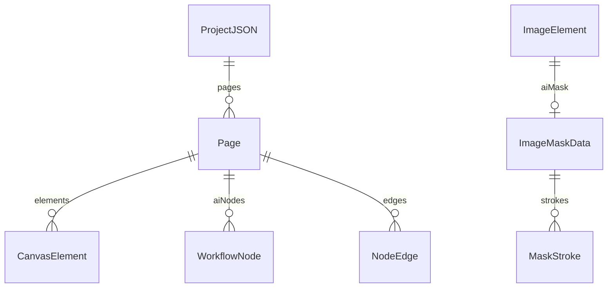

| 类型 | 字段要点 |
|------|-----------|
| `Page` | `id`、`name`、`elements: CanvasElement[]`、**`aiNodes: WorkflowNode[]`**、**`edges: NodeEdge[]`**；旧字段 **`workflow?: WorkflowGraph`** 已废弃，由 `migratePage` 迁到 `aiNodes`/`edges` |
| `ProjectJSON` | `version`（如 `"2.0.0"`）、`savedAt`、`pages`（已含各页的 `aiNodes`/`edges`）、`activePageId` |
| `ImageMaskData` | `version`、`width`、`height`、与画布元素框一致的逻辑分辨率、`strokes[]` |
| `MaskStroke` | `tool: brush|eraser`、`points`（扁平 `[x0,y0,x1,y1,...]`）、`color`、`size`、`opacity`、`hardness` |

### 4.3 画布 AI 工作流相关类型（`src/workflow/types.ts`）

| 类型 | 含义 |
|------|------|
| `WorkflowNode` | 画布上 AI 功能节点实例：`id`、`type`、`title`、`x/y/width/height`、`status`、`params`、`outputs`（如 `image` 的 `url`）、`error?` 等 |
| `NodeEndpoint` | 连线端点：**图片元素端口** `kind: "image-element"`（`image` \| `mask`）或 **AI 节点端口** `kind: "ai-node"` |
| `NodeEdge` | 有向边：`from` → `to` 均为 `NodeEndpoint`，带 `dataType`（与端口类型一致） |
| `WorkflowNodeDefinition` | 注册表中的 **类型定义**：`inputs`/`outputs` 端口、`params`、`executor`（后端 executor id 或 `"none"`）、`showRunBar` 等 |
| `EditorMode` | 当前仅 **`"canvas"`**（统一画布，已无独立「纯工作流页」模式） |

---

## 5. Zustand 状态管理

### 5.1 `EditorState` 与 Store 扩展

`EditorState`（`types.ts`）除画布与视口外，还包含 **工作流 UI 状态**：

| 字段 | 作用 |
|------|------|
| `editorMode` | 恒为 `canvas`（保留字段，便于将来扩展） |
| `selectedWorkflowNodeIds` | 多选 AI 节点 id；与 `selectedIds` 互斥策略见 store（选节点时常清空元素选区） |
| `workflowConnecting` | 从端口拖线中的临时状态（起点端点、指针世界坐标、`dataType`） |
| `workflowNodePicker` | 松手后弹出 **创建节点** 选择器的位置与上下文 |

`store.ts` 中 `Store` 另含非持久化 UI 标志、历史、剪贴板及大量方法，摘要：

| 字段 / 方法 | 作用 |
|-------------|------|
| `marqueeSelecting` | 框选中：用于隐藏浮动条 |
| `floatingToolbarSuppressed` | 拖动画布 / 元素 / 变换时抑制浮动条 |
| `historyPast` / `historyFuture` | 撤销重做；快照类型 `Snapshot` 含 **`pages`、`activePageId`、`selectedIds`、`selectedWorkflowNodeIds`、`zoom`、`pan`** |
| `clipboard` | 复制粘贴（画布元素或工作流子图，见 `EditorClipboard`） |
| `commitHistory` | 推入快照；`updateElement` 等默认会先 `commitHistory`（可用 `options.history: false` 关闭） |
| `replaceImageKeepFrame` | 换 `src` 并重置裁剪与 `aiMask` |
| `setImageAIMask` / `clearImageAIMask` | AI 蒙版写入 |
| **`addWorkflowNode` / `updateWorkflowNode` / `removeWorkflowNode`** | AI 节点 CRUD |
| **`addWorkflowEdge` / `removeWorkflowEdge`** | 统一图边 |
| **`startWorkflowConnecting` / `updateWorkflowConnectingPointer` / `cancelWorkflowConnecting`** | 连线交互 |
| **`createWorkflowNodeFromPicker`** | 从选择器创建节点并自动接好一条入边（若兼容） |
| **`runWorkflowNode`** | 运行节点：`output-view` 等 **纯前端** 分支；否则 `serializeWorkflowInputsForApi` → **`POST /api/workflow/run-node`** → 写回 `outputs` |
| **`sendWorkflowResultToCanvas`** | 将节点某路 `image` 输出落成画布 `ImageElement` |
| `exportProjectJSON` / `loadProjectJSON` | 完整工程（**含每页 `aiNodes`/`edges`**）；`load` 时 `migratePage` |
| `saveLocal` | 立即写 `localStorage`（**未**走防抖与瘦身逻辑；见 [§13](#13-保存与加载-json--localstorage)） |
| `saveRemote` / `loadRemote` | `fetch` POST/GET `ProjectJSON` |

### 5.2 历史记录边界

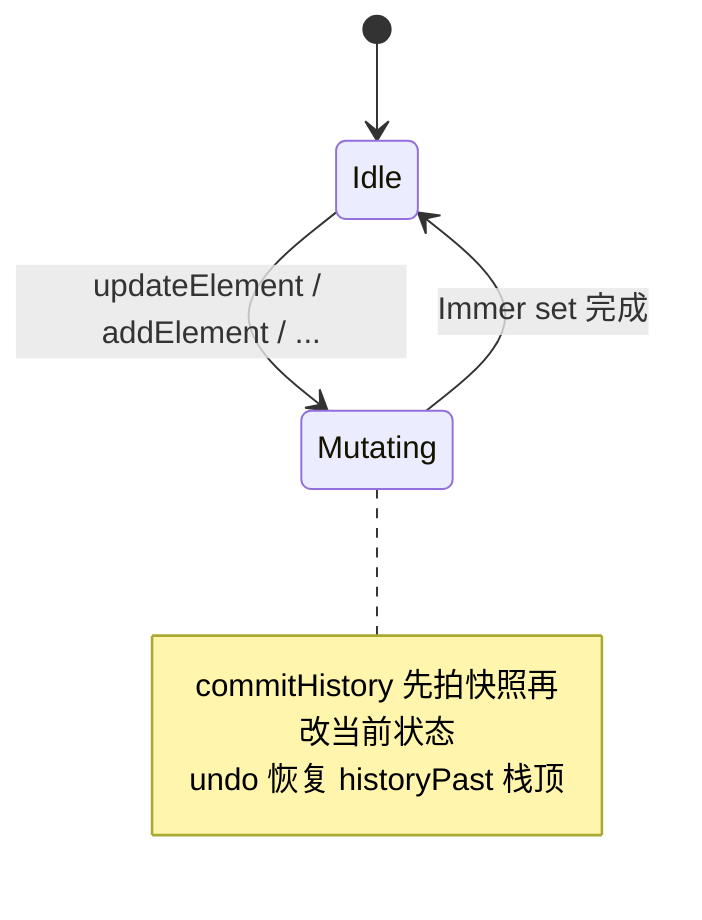

**要点**：`renamePage`、部分 UI 标志位可能 **不** 入历史；工作流节点在 **`runWorkflowNode` 成功/失败收尾** 或 **`output-view` 同步完成** 时会 `commitHistory`，而运行中的 `running` 更新通常 `history: false`。

### 5.3 自动持久化（`localStorage`）

- **键名**：`STORAGE_KEY` = `AI_CANVAS_PRO_PROJECT_V2`（`store.ts`）。
- **触发**：`useEditorStore.subscribe` 在 **每次 `setState` 后** 调度一次写入（**防抖约 600ms**），合并短时间内的连续更新（框选、抑制浮动条等），避免同步 `JSON.stringify` 整包 `pages` 造成卡顿。
- **写入字段**：`pages`、`activePageId`、`zoom`、`pan`、`quickToolbarConfig`、`editorMode`。
- **配额与异常**：`tryWriteProjectToLocalStorage` 内 **`try/catch`**；若 `QuotaExceededError`，对 **克隆体** 中长 **`data:`** URL（画布大图、节点 `image`/`mask` 输出）按阈值 **替换为 1×1 占位 PNG** 后分级重试，**不向业务逻辑抛异常**（避免拖拽/连线因 `setItem` 失败而卡死）。
- **选择状态**：`selectedIds` / `selectedWorkflowNodeIds` **默认不落盘**（加载后清空或按需初始化）。

---

## 6. React 组件职责

| 组件 | 与 Store 的关系 | 主要职责 |
|------|-----------------|----------|
| `App` | `useEditorStore()` 全量或按需订阅 | 布局、打开各 Modal、文件 input、导出整 Stage PNG、桥接 `stageRef` |
| `StageCanvas` | `zoom`/`pan`/`selectedIds`/页面数据/连线状态等 | **唯一主舞台**；元素与 **边、图片端口 overlay、工作流节点**；框选、Transformer、右键、**临时连线**（贝塞尔预览线 `listening={false}`） |
| `WorkflowNodeView` | 读 `node`、写 `updateWorkflowNode`、触发 `runWorkflowNode` 等 | 单节点 UI：端口、预览、运行按钮、Konva 拖拽（**不在 `onDragMove` 每帧写回 store**，避免与 Konva 拖拽打架） |
| `FloatingToolbar` | 选中元素、`zoom`/`pan`、`marqueeSelecting`、`floatingToolbarSuppressed` | HTML 浮层；世界坐标 AABB → 屏幕定位 |
| `CropEditorModal` | `updateElement`、`clone` | 裁剪 UI；写回图片专用字段 |
| `MaskEditorModal` | `setImageAIMask` | 笔刷编辑 `aiMask.strokes` |
| `AiGenerateModal` | `getActivePage`、`selectedIds`、`addElement`、`replaceImageKeepFrame` | **单步**生图请求与落版 |
| `MiniMap` | 读页面与视口 | 缩略导航 |
| `LibraryPanel` | 添加预设图等 | 素材入口 |

**原则**：**可序列化状态尽量只在 Zustand**；Modal 内临时 UI 状态用 `useState`，确认时再调用 store。

---

## 7. 画布坐标系统

### 7.1 三层坐标心智模型

| 层级 | 含义 | 典型用途 |
|------|------|----------|
| **世界坐标（World）** | 与 `CanvasElement.x/y/width/height` 及 **`WorkflowNode` 的 `x/y`** 一致 | Store、对齐、导出 JSON、浮动条 AABB、**边与端口锚点** |
| **舞台内容坐标** | `Stage` 子节点在 **应用了 `scaleX/Y=zoom` 与 `x/y=pan`** 之后的坐标系 | Konva 内部节点与 Transformer |
| **屏幕 / 客户端坐标** | 浏览器视口、`getBoundingClientRect` | 右键菜单、`FloatingToolbar` 的 `position: fixed`、**节点选择器屏幕定位** |

### 7.2 世界 ← 指针（StageCanvas 中的模式）

Stage 上监听指针时，将容器坐标转为世界坐标：

\[
x_{\text{world}} = \frac{x_{\text{pointer}} - pan_x}{zoom},\quad
y_{\text{world}} = \frac{y_{\text{pointer}} - pan_y}{zoom}
\]

（与代码中 `(point.x - pan.x) / zoom` 一致。）

### 7.3 Konva 与元素 `rotation`

Konva `Group` 默认变换顺序可理解为：**先平移到 `(x,y)`，再绕本地原点旋转**。因此计算元素在父坐标系下的 **轴对齐包围盒（AABB）** 时，应将 **本地四角** `(0,0),(w,0),(w,h),(0,h)` 旋转后再加上 `(x,y)`，而不是绕矩形中心旋转（除非节点建模不同）。浮动条若用错 pivot，旋转后会压在图层上。

### 7.4 主舞台 `Layer` 结构（性能）

主 `Stage` 使用 **3 个 `Layer`**（原为 7 层合并而来），以满足 Konva「建议 ≤3～5 层」的提示并减少合成开销：

1. **背景层** `listening={false}`：网格 + 已确定的 **边**（折线/贝塞尔，`listening={false}`）。
2. **内容层**：根级 `ElementNode` → **`ImageWorkflowPortsOverlay`**（图片端口）→ **`WorkflowNodeView`**（保证端口在 AI 节点 **下方**，避免挡输入口点击）。
3. **交互与装饰层**：对齐线、框选矩形、`Transformer`、**拖线中的临时虚线**（`Line` 上 `listening={false}`，避免挡下层点击）。

小地图等若另有独立 `Stage`，其层数单独计算。

---

## 8. 图片裁剪

### 8.1 两套「旋转」不要混

| 概念 | 存储字段 | 含义 |
|------|----------|------|
| **画布上整图旋转** | `ImageElement.rotation` | 整个图层相对画布旋转 |
| **裁剪框内源图旋转** | `cropRotation` | 仅在 **裁剪编辑器 / 绘制贴图** 时，对源位图做旋转（`export.ts` 里 `ctx.rotate(cropRotation)`） |

另外还有 **`cropOffsetX/Y`**（平移源图）、**`cropScale`**（在 cover 比例基础上的额外缩放）、**`flipX`/`flipY`**。

### 8.2 与 Konva 渲染的关系

`StageCanvas` 中图片节点使用与 `exportCroppedImageAsPNG` 一致的 **中心对齐 + cropRotation + scale + drawImage** 逻辑，保证 **屏上所见 ≈ 导出逻辑**（跨域图导出可能受 CORS 限制，代码里已有提示）。

### 8.3 裁剪数据流

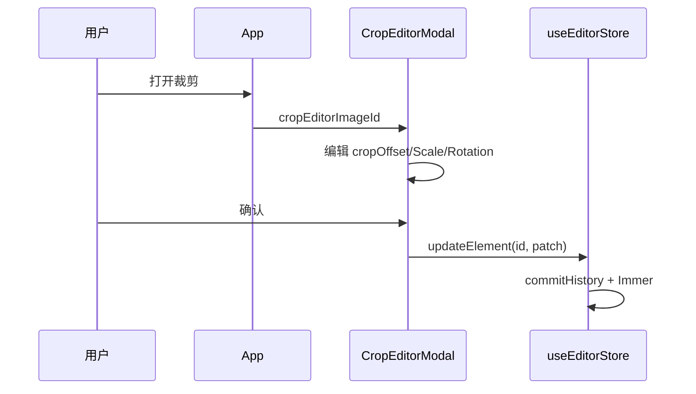

---

## 9. AI 蒙版

### 9.1 数据形态

`aiMask` 为 **矢量笔划列表** + 逻辑尺寸，而非直接存 PNG。好处：可编辑、可版本迭代；请求时再栅格化。

### 9.2 栅格化与上传

`MaskEditorModal` 在保存时组装 `ImageMaskData` → `setImageAIMask`。

`AiGenerateModal` 在请求前调用 `exportImageMaskToDataURL`（`mask.ts`）：离屏 `canvas` 上按 stroke 重放路径，**橡皮**用 `globalCompositeOperation = 'destination-out'`。

前端将 `mask` 以 **dataURL** 放入 JSON；后端 `normalize_request_images` 内 **`ensure_url` → OSS**，网关侧始终收到 **http(s) URL**。

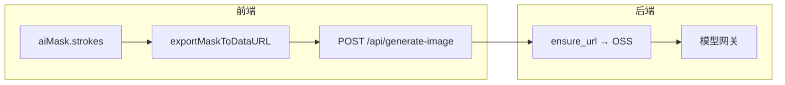

---

## 10. AI 生图调用流程

产品上有 **两条并行能力**：

| 入口 | 用途 | 典型 API |
|------|------|----------|
| **`AiGenerateModal`** | 选中图层后的 **单步**生图 / 图生图 / inpaint | `POST /api/generate-image` |
| **画布 `WorkflowNode`** | **多节点图**、端口依赖、可组合多步（每步一次 `run-node` 或前端同步） | `POST /api/workflow/run-node`（见 [§17](#17-画布-ai-节点工作流当前实现)） |

### 10.1 模式判定（`AiGenerateModal`）

| 条件 | `mode`（示意） | 行为 |
|------|------------------|------|
| 选中图 + 有 `aiMask` + 导出蒙版成功 | `inpaint` | 传 `image` + `mask` |
| 选中图、无蒙版 | `image-to-image` | 仅 `image` |
| 未选中图或非图 | `generate` | 可无图 |

### 10.2 结果落画布（单步弹窗）

| 条件 | 结果 |
|------|------|
| `outputMode === "replace-selected"` 且选中单图 **且无** 蒙版 | `replaceImageKeepFrame(id, url)`：只换 `src`，外框与蒙版形状等保留策略见 store |
| 其它 | `layoutNewAiImageBox` 计算新图 `x,y,width,height`（参考图在右侧，`NEW_AI_IMAGE_GAP`），`addElement` 新 `ImageElement` |

### 10.3 端到端时序（单步）

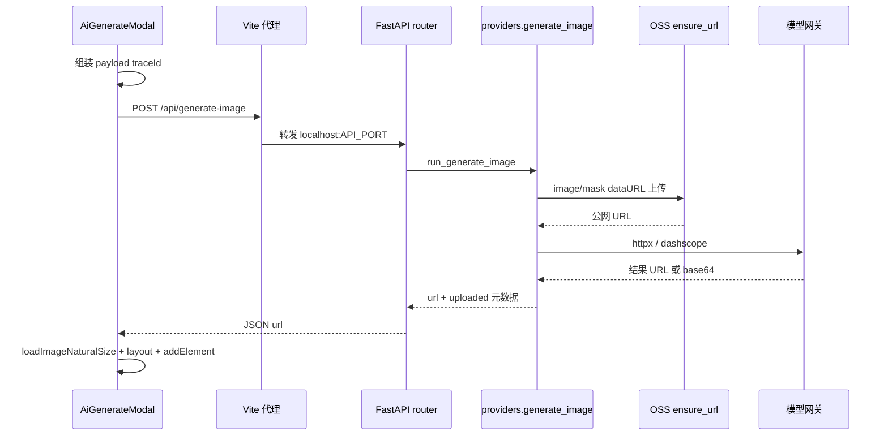

### 10.4 与后端模型表对齐

前端 `AiGenerateModal` 中的 `PROVIDERS` / `MODEL_CHOICES` 应与各 `backend/app/providers/*.py` 中的 `models` 列表及网关文档 **保持一致**，否则 UI 可选到后端不认识的 model。

---

## 11. Python 后端

### 11.1 分层

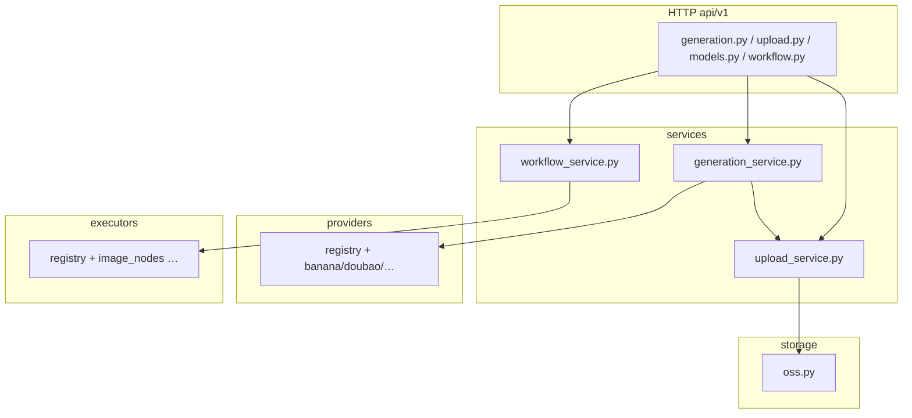

| 模块 | 职责 |
|------|------|
| `api/v1/workflow.py` | **`POST /workflow/run-node`**：校验体 → `workflow_service.run_node` |
| `services/workflow_service.py` | 按 **`nodeType`** 从 **`executor_registry`** 取执行器，传入序列化后的 `inputs` / `params` / `traceId` |
| `executors/*.py` | 节点类型到具体计算/转调（可内部再调 OSS、网关或纯 Python 图像逻辑） |
| `api/v1/*.py`（其余） | 参数绑定、HTTP 异常、`request_id` |
| `services/generation_service.py` | 单步生图：归一化 image/mask URL、选 provider、组装响应、日志 |
| `services/upload_service.py` | dataURL → `storage.ensure_url` |
| `providers/*.py` | 各厂商单步生图：构建 payload、`httpx` 或 Dashscope、解析 `url` |
| `utils/http.py` | `post_json_with_retry`（网络/5xx/429 重试） |
| `storage/oss.py` | 上传字节流 / dataURL |
| `middleware/request_logging.py` | 请求日志、耗时 |

### 11.2 环境变量（概念分组）

| 类别 | 示例变量 | 用途 |
|------|-----------|------|
| 网关与密钥 | `BANANA_API_KEY`、`DOUBAO_API_KEY`、`COMFLY_BASE_URL` 等 | 调用外部 API |
| OSS | `OSS_ACCESS_KEY_ID`、`OSS_SECRET`、`OSS_ENDPOINT`、`OSS_BUCKET`、`OSS_PUBLIC_BASE_URL` 等 | 上传与返回 URL |
| 服务 | `API_PORT` | 与 Vite 代理一致 |
| 调试 | `RETURN_RAW_RESPONSE` | 是否在响应中带原始上游 JSON |

具体以 `backend/app/core/settings.py`、`backend/app/storage/oss.py` 为准。

---

## 12. OSS 上传

### 12.1 `ensure_url` 行为

| 输入 | 输出 |
|------|------|
| `null` / 空 | `null` |
| `http(s)://...` | **原样返回**（认为已是网关可拉取的 URL） |
| `data:image/...;base64,...` | 解码 → 临时文件 → **PUT OSS** → 返回 `OSS_PUBLIC_BASE_URL + key` |

### 12.2 对象键与追溯

`generate_oss_object_key` 会混入 `traceId`、`api_name`（如 `source` / `mask` / `ref0`）、日期与随机散列，便于在桶内按业务追踪。

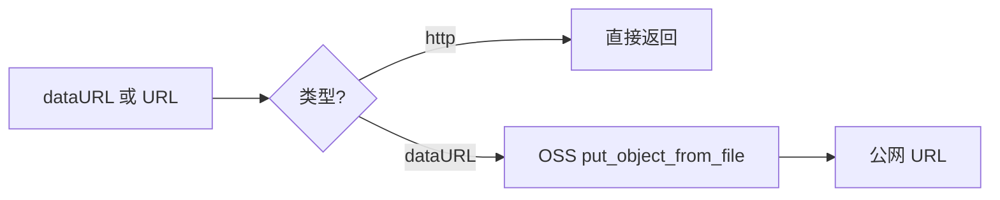

---

## 13. 保存与加载 JSON / localStorage

### 13.1 「保存」路径对照

| 机制 | API / 位置 | 说明 |
|------|--------------|------|
| **自动** | `useEditorStore.subscribe` → **`tryWriteProjectToLocalStorage`** | **防抖**；**配额保护**；见 [§5.3](#53-自动持久化localstorage) |
| **手动立即写盘** | `saveLocal()` | 直接 `JSON.stringify` + `setItem`，**不**含防抖与瘦身；大项目慎用 |
| **手动导出文件** | `exportProjectJSON` + `downloadJSON`（`export.ts`） | 用户下载 `ProjectJSON`（**含 `aiNodes`/`edges`**） |
| **手动选文件导入** | `readJSONFile` + `loadProjectJSON` | `migratePage` 迁移旧页；失败时 UI alert |
| **远程** | `saveRemote(url)` / `loadRemote(url)` | `fetch` POST/GET；**需自备**接受/返回 `ProjectJSON` 的服务 |

### 13.2 `ProjectJSON` 与 `localStorage` 快照的差异

| 内容 | `ProjectJSON` 文件 | `localStorage` 自动快照 |
|------|-------------------|------------------------|
| `pages`（含 `aiNodes`、`edges`） | ✓ | ✓ |
| `activePageId` | ✓ | ✓ |
| `zoom`、`pan` | 导出结构以 store 为准 | ✓ |
| `quickToolbarConfig` | 默认导出体可能不含；以 `exportProjectJSON` 实现为准 | ✓ |
| `editorMode` | 随 `pages` 持久化需求可选 | ✓ |
| `selectedIds` / `selectedWorkflowNodeIds` | 一般不依赖 | **不**写入自动快照 |

若超大 **`data:`** 图导致配额命中，自动快照可能已将长 data URL **替换为占位图**；**以导出文件为准**做完整备份更可靠；生产环境建议 **大图走 OSS URL**，减少 `pages` 体积。

---

## 14. 典型用户操作数据流

### 14.1 移动与吸附

用户拖曳 Group → `StageCanvas` `dragBoundFunc` / `dragend` → `updateElement` 更新 `x,y`（可能合并吸附与组合子项相对位移）。

### 14.2 变换缩放

Transformer `transformend` → 将 `scaleX` 等收敛到 `width/height`（代码里对图片/矩形等有统一处理）→ `updateElement`。

### 14.3 组合

多选 → `groupSelected`：计算包围盒，新建 `group` 元素，子元素设 `parentId`。

### 14.4 AI 局部重绘闭环（单步弹窗）

选中图片 → 打开蒙版编辑 → 笔划 → 保存写入 `aiMask` → 打开生图 Modal → 带 `mask` dataURL 请求 → 后端上传 OSS → 网关 inpaint → 新图层或替换策略。

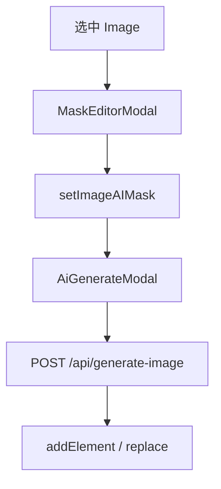

### 14.5 画布工作流（节点 + 连线）

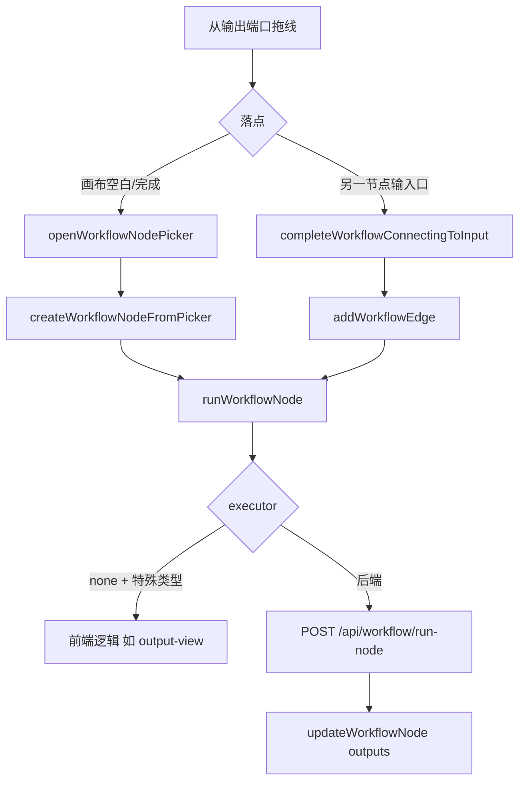

---

## 15. 容易混淆的问题

| 混淆点 | 说明 |
|--------|------|
| **元素 `rotation` vs `cropRotation`** | 前者是图层在画布上转；后者只影响「框内如何切源图」。 |
| **展示蒙版 `maskShape` vs AI 蒙版 `aiMask`** | 前者是 **clip 形状**（圆角矩形/圆）；后者是 **笔刷栅格语义**，用于 inpaint。 |
| **世界坐标 AABB vs Konva `getClientRect`** | 若自算 AABB，旋转 pivot 必须与 Konva 一致（见第 7 节）。 |
| **`parentId` 与 `group.children`** | 当前数据模型二者并存；修改组合逻辑时需保持同步，避免孤儿引用。 |
| **历史栈与 `updateElement`** | 默认每次 `updateElement` 会 `commitHistory`；高频事件若在中间态也入栈会导致撤销粒度异常——**工作流节点拖拽**应避免在 `onDragMove` 写回 `x/y`，在 `dragend` 一次性提交。 |
| **`localStorage` 与 `QuotaExceededError`** | 自动订阅路径已 **防抖 + try/catch + 长 data URL 瘦身**；`saveLocal` 仍可能因过大而失败，重要工程请用 **导出 JSON** 或远程。 |
| **旧 `Page.workflow` vs `aiNodes`/`edges`** | 加载时走 `migratePage`；新代码只应维护 **统一图** 模型。 |
| **跨域图片** | `crossOrigin = anonymous` 仍可能因 CDN 策略无法 `toDataURL`；导出 PNG 会失败，需换同源或代理。 |
| **`/api` 路径** | 开发环境依赖 Vite 代理；生产部署需 **同源反向代理** 或改 `fetch` 基地址。 |
| **端口** | `vite.config.ts` 默认 `API_PORT=13555` 与 `package.json` 中 uvicorn 一致；只改一端会 502。 |
| **控制台里的 `chrome-extension://…`** | 多为浏览器扩展注入脚本失败，**与本仓库无关**；可用无痕/禁用扩展排除。 |

---

## 16. 如何扩展

### 16.1 扩展「单步生图」弹窗

| 步骤 | 做法 |
|------|------|
| 新增后端能力 | `schemas/generation.py` 等增加可选字段 → 扩展 `providers/*.py` 或注册新 provider → `generation_service` |
| 新增前端参数 | `AiGenerateModal` 表单并入 `payload`；与后端字段名对齐 |

### 16.2 扩展「画布 AI 节点」

| 步骤 | 做法 |
|------|------|
| 定义 | 在 `src/workflow/nodes/<name>.ts` 导出 **`WorkflowNodeDefinition`**（`type`、`inputs`/`outputs`、`params`、`executor`、`showRunBar?`、`preview?` 等），并在 **`nodeRegistry.ts`** 注册 |
| 后端执行器 | 在 `backend/app/executors/` 实现并在 **`executor_registry`** 按 **`nodeType`** 注册；与定义里的 **`executor`** 字符串一致 |
| 序列化 | 若输入来自上游边，检查 **`serializeWorkflowInputsForApi` / `resolveAiNodeInputs`** 是否需要新端口 id 或类型分支 |
| 纯前端节点 | `executor: "none"`，必要时 `showRunBar: true`；在 **`runWorkflowNode`** 内为特定 `node.type` 写分支（参考 `output-view`） |

### 16.3 扩展画布元素类型

在 `types.ts` 增加 `ElementType` 与联合成员；`StageCanvas` / `ElementNode` 增加渲染分支；注意 **`export.ts`** 与组合/对齐逻辑。

### 16.4 与 Cursor / SDK 自动化结合

优先通过 **`ProjectJSON`** 或 **store 级 API**（`loadProjectJSON`、`setSelectedIds`、`replaceImageKeepFrame`、`runWorkflowNode` 等）交换，而非模拟 UI 点击。

---

## 17. 画布 AI 节点工作流（当前实现）

### 17.1 统一图模型

- 每张 **`Page`** 同时持有 **`elements`**（位图/矢量等）与 **`aiNodes`**（AI 功能块），用 **`edges`** 连接 **图片元素端口** 与 **AI 节点端口**（或 AI→AI）。
- **旧** `Page.workflow`（仅 AI 子图）由 **`migrateLegacyWorkflowGraph` / `migratePage`** 在加载时迁到 `aiNodes` + `edges`。

### 17.2 前端注册表与创建

- **`WORKFLOW_NODE_REGISTRY`**：`type` → `WorkflowNodeDefinition`。
- **`createWorkflowNode(type, x, y)`**：生成运行时 `WorkflowNode`（默认尺寸、初始 `params` 等）。
- **`listCreatableWorkflowNodes(fromDataType)`**：从端口拖线创建时，过滤 **可接收该数据类型** 的节点定义。

### 17.3 运行路径

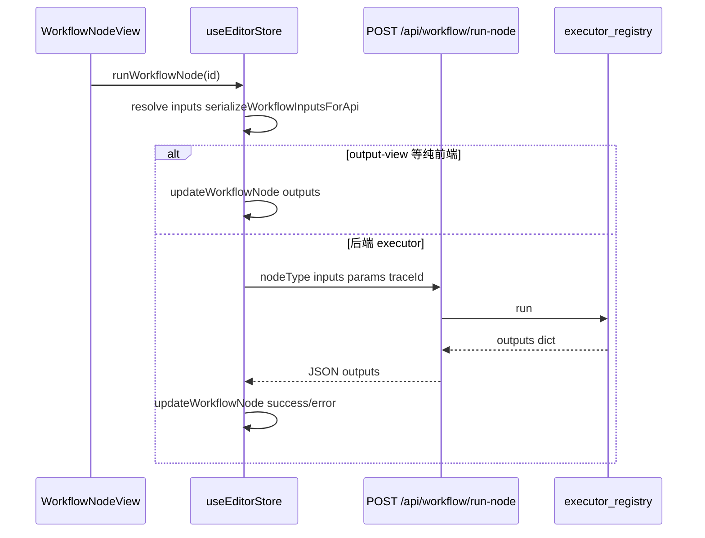

### 17.4 与单步生图的关系

- **单步弹窗**走 **`/api/generate-image`** 与 **`providers`** 体系。
- **工作流节点**走 **`/api/workflow/run-node`** 与 **`executors`** 体系。二者可复用同一 OSS/网关能力，但 **路由与注册表分离**，扩展时勿混用。

---

## 附录：关键文件速查

| 主题 | 文件 |
|------|------|
| 类型定义 | `src/editor/types.ts`、`src/workflow/types.ts` |
| 状态与持久化 | `src/editor/store.ts` |
| 主画布 | `src/components/StageCanvas.tsx` |
| 工作流节点视图 | `src/components/workflow/WorkflowNodeView.tsx` |
| 节点注册与定义 | `src/workflow/nodeRegistry.ts`、`src/workflow/nodes/*.ts` |
| 统一图工具 | `src/workflow/utils/unifiedGraph.ts`、`runPayload.ts`、`createNode.ts` |
| 单步 AI 请求 | `src/components/AiGenerateModal.tsx` |
| 蒙版栅格化 | `src/editor/mask.ts` |
| 裁剪导出 | `src/editor/export.ts` |
| 后端入口 | `backend/app/main.py`（`uvicorn backend.app.main:app`） |
| 单步生图编排 | `backend/app/services/generation_service.py` + `backend/app/providers/` |
| 工作流节点 API | `backend/app/api/v1/workflow.py` + `services/workflow_service.py` + `executors/` |
| OSS | `backend/app/storage/oss.py` |
| 开发代理 | `vite.config.ts` |

---

*文档版本与仓库代码同步维护；若接口或字段变更，请同时更新本文档「附录」引用的行为描述。*
