# AI Canvas 项目架构学习文档

> 面向：**React + Konva + Zustand + FastAPI** 全栈维护者。  
> 目标：系统理解定位、数据流、坐标与 AI 链路，并能安全扩展。

---

## 目录

1. [项目定位](#1-项目定位)
2. [技术栈](#2-技术栈)
3. [仓库目录结构](#3-仓库目录结构)
4. [核心数据模型](#4-核心数据模型)
5. [Zustand 状态管理](#5-zustand-状态管理)
6. [React 组件职责](#6-react-组件职责)
7. [画布坐标系统](#7-画布坐标系统)
8. [图片裁剪](#8-图片裁剪)
9. [AI 蒙版](#9-ai-蒙版)
10. [AI 生图调用流程](#10-ai-生图调用流程)
11. [Python 后端](#11-python-后端)
12. [OSS 上传](#12-oss-上传)
13. [保存与加载 JSON](#13-保存与加载-json)
14. [典型用户操作数据流](#14-典型用户操作数据流)
15. [容易混淆的问题](#15-容易混淆的问题)
16. [如何扩展成 AI 工作流](#16-如何扩展成-ai-工作流)

---

## 1. 项目定位

| 维度 | 说明 |
|------|------|
| **产品形态** | 浏览器内的 **可视化画布编辑器**（类 Figma 的简化版）：多页面、图层、选择/变换、对齐、组合、小地图、素材库。 |
| **差异化能力** | 集成 **AI 生图 / 图生图 / 局部重绘（inpaint）**：前端维护 `ImageElement` 与笔刷蒙版数据，经 FastAPI 归一化（含 OSS）后调用多家模型网关。 |
| **数据真相源** | 前端 **Zustand + Immer** 持有的 `pages[].elements[]`；持久化以 **localStorage** 为主，另支持 **导出/导入 JSON** 与 **任意 URL 的远程保存/加载**（由你方服务端实现契约）。 |
| **运行时** | `npm run dev` 通过 **concurrently** 同时起 **Vite（5173）** 与 **uvicorn（默认 13555）**；Vite 将 `/api` **代理**到后端，避免 CORS 与端口混用问题。 |

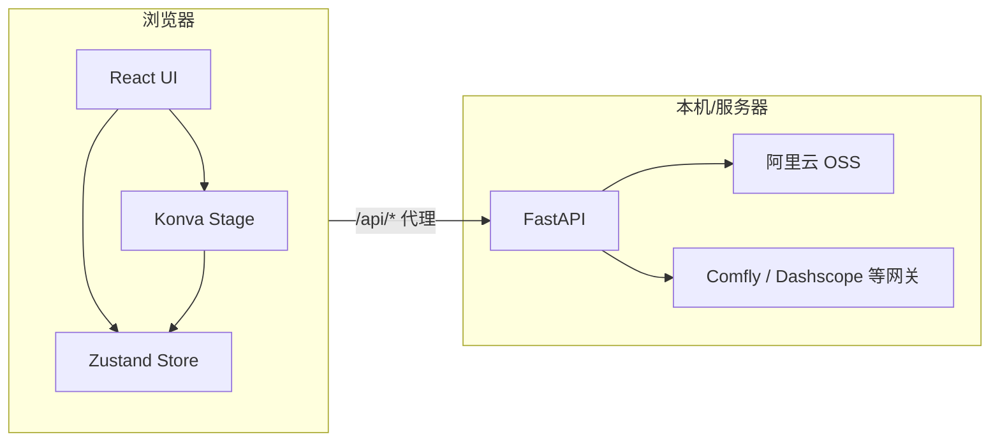

---

## 2. 技术栈

### 2.1 前端

| 技术 | 版本（参考 `package.json`） | 用途 |
|------|---------------------------|------|
| React | 19.x | UI 与状态订阅 |
| TypeScript | ~5.6 | 类型安全 |
| Vite | 6.x | 开发与构建；`/api` 代理 |
| Konva / react-konva | 9.x / 19.x | 2D 画布、变换器、滤镜、裁剪预览 |
| Zustand | 5.x | 全局编辑器状态 |
| Immer (`produce`) | 10.x | 不可变式深层更新 |
| nanoid | 5.x | id 生成 |

### 2.2 后端

| 技术 | 用途 |
|------|------|
| FastAPI | HTTP API：`/api/health`、`/api/models`、`/api/upload-image-url`、`/api/generate-image` |
| httpx | 同步 HTTP 客户端，调用外部图生图网关（带重试） |
| dashscope | 通义 Qwen 等调用路径 |
| alibabacloud-oss-v2 | 将 dataURL 上传 OSS，返回公网 URL |
| Pillow | 图像辅助（如豆包尺寸计算） |
| uvicorn | ASGI 服务 |

---

## 3. 仓库目录结构

| 路径 | 职责 |
|------|------|
| `src/main.tsx` | React 入口 |
| `src/App.tsx` | 应用壳：顶栏、侧栏、模态框开关、`stageRef`、导入导出入口 |
| `src/components/StageCanvas.tsx` | **主画布**：Stage/Layer、元素渲染、Transformer、吸附、框选、右键回调 |
| `src/components/FloatingToolbar.tsx` | 选中元素上方的 **快捷工具条**（Portal + 世界坐标 AABB） |
| `src/components/CropEditorModal.tsx` | **裁剪编辑器**（独立 Konva 场景，写回 `cropOffset*` / `cropScale` / `cropRotation` / flip） |
| `src/components/MaskEditorModal.tsx` | **AI 蒙版笔刷**编辑器，写回 `aiMask` |
| `src/components/AiGenerateModal.tsx` | **AI 生图**：组装 payload → `POST /api/generate-image` → 新图层或替换 |
| `src/components/AiChatPanel.tsx` | 侧栏 AI 对话/附件（与画布松耦合） |
| `src/components/LibraryPanel.tsx` | 素材库 |
| `src/components/MiniMap.tsx` | 小地图导航 |
| `src/components/ContextMenu.tsx` | 右键菜单 |
| `src/components/QuickToolbarSettings.tsx` | 快捷条按钮配置 |
| `src/editor/types.ts` | **核心类型**：元素、页面、蒙版、ProjectJSON |
| `src/editor/store.ts` | **Zustand Store**：页面、选择、历史、剪贴板、图层顺序、AI 蒙版 API |
| `src/editor/export.ts` | JSON 下载/读取、滤镜与 clipPath、`exportCroppedImageAsPNG` |
| `src/editor/mask.ts` | 蒙版 strokes → PNG dataURL |
| `src/editor/quickTools.ts` | 快捷条工具 id 与白名单 |
| `src/lib/aiImageLayout.ts` | 生图结果 **布局**（宽高比、相对参考图右侧摆放） |
| `src/lib/apiDebug.ts` / `apiFormat.ts` | 前端 API 日志与错误格式化 |
| `backend/main.py` | 兼容入口，转发 `backend.app.main` |
| `backend/app/main.py` | FastAPI 应用工厂：CORS、中间件、挂载 `/api` |
| `backend/app/api/v1/*.py` | 路由：`generation`、`upload`、`models`（health + models 列表） |
| `backend/app/schemas/` | Pydantic：`generation.py`、`upload.py` |
| `backend/app/providers/` | 各厂商适配（payload + HTTP / Dashscope），`registry.py` 汇总 |
| `backend/app/services/` | **业务编排**：`generation_service`、`upload_service` |
| `backend/app/storage/oss.py` | OSS 与 `ensure_url` |
| `backend/app/core/settings.py` | **Pydantic Settings**：环境变量、CORS、日志路径等 |
| `backend/app/core/logging.py` | 文件日志初始化 |
| `backend/app/utils/` | HTTP 重试、图片尺寸、日志脱敏 |
| `start-dev.sh` | 检查 `npm`/`uv`，必要时 `npm install` / `uv sync`，执行 `npm run dev` |
| `doc/` | 本文档与其它说明 |

---

## 4. 核心数据模型

### 4.1 元素类型（ discriminated union ）

定义见 `src/editor/types.ts`。所有元素共享 `BaseElement`：`id`、`name`、`type`、`x/y/width/height`、`rotation`、`opacity`、`visible`、`locked`、`parentId?`。

| `type` | 说明 | 特有字段（摘要） |
|--------|------|------------------|
| `image` | 位图图层 | `src`；**裁剪**：`cropOffsetX/Y`、`cropScale`、`cropRotation`；**展示蒙版**：`maskShape`、`cornerRadius`；**滤镜**；**AI 蒙版**：`aiMask` |
| `rect` | 矩形 | `fill`、`radius`、`stroke*` |
| `text` | 文字 | `text`、`fontSize`、`fontFamily`、`align` 等 |
| `arrow` | 箭头 | `stroke`、`strokeWidth` |
| `group` | 组合 | `children: string[]`；子元素通过 `parentId` 指向组 |

### 4.2 页面与工程 JSON

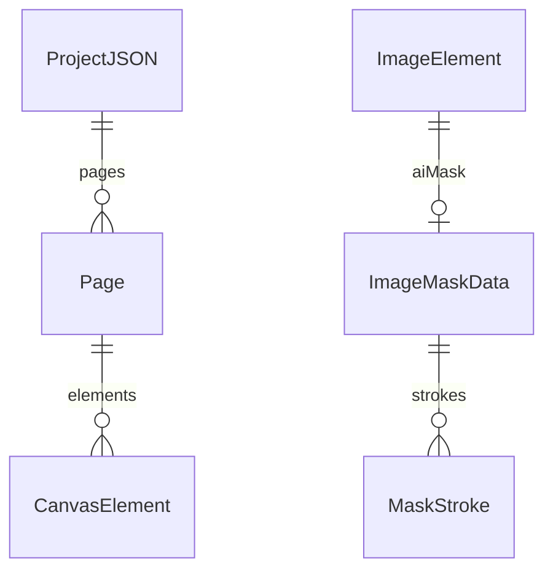

| 类型 | 字段要点 |
|------|-----------|
| `Page` | `id`、`name`、`elements: CanvasElement[]` |
| `ProjectJSON` | `version`（如 `"2.0.0"`）、`savedAt`、`pages`、`activePageId` |
| `ImageMaskData` | `version`、`width`、`height`、与画布元素框一致的逻辑分辨率、`strokes[]` |
| `MaskStroke` | `tool: brush|eraser`、`points`（扁平 `[x0,y0,x1,y1,...]`）、`color`、`size`、`opacity`、`hardness` |

---

## 5. Zustand 状态管理

### 5.1 `EditorState` 与 Store 扩展

`EditorState`（`types.ts`）描述 **可持久化/可导出** 的核心：`pages`、`activePageId`、`selectedIds`、`zoom`、`pan`、`tool`、`editingTextId`、`quickToolbarConfig`。

`store.ts` 中的 `Store` 额外包含：

| 字段 / 方法 | 作用 |
|-------------|------|
| `marqueeSelecting` | 框选中：用于隐藏浮动条 |
| `floatingToolbarSuppressed` | 拖拽/变换时抑制浮动条 |
| `historyPast` / `historyFuture` | 撤销重做（快照为 `pages`、`activePageId`、`selectedIds`、`zoom`、`pan`） |
| `clipboard` | 复制粘贴 |
| `commitHistory` | 在变更前推入快照（注意：`updateElement` 默认会先 `commitHistory`） |
| `replaceImageKeepFrame` | 换 `src` 并重置裁剪与 `aiMask` |
| `setImageAIMask` / `clearImageAIMask` | AI 蒙版写入 |
| `exportProjectJSON` / `loadProjectJSON` | 完整工程序列化 |
| `saveLocal` | 写 localStorage（也被 `subscribe` 自动同步） |
| `saveRemote` / `loadRemote` | `POST`/`GET` 任意 URL 的 JSON 契约 |

### 5.2 历史记录边界

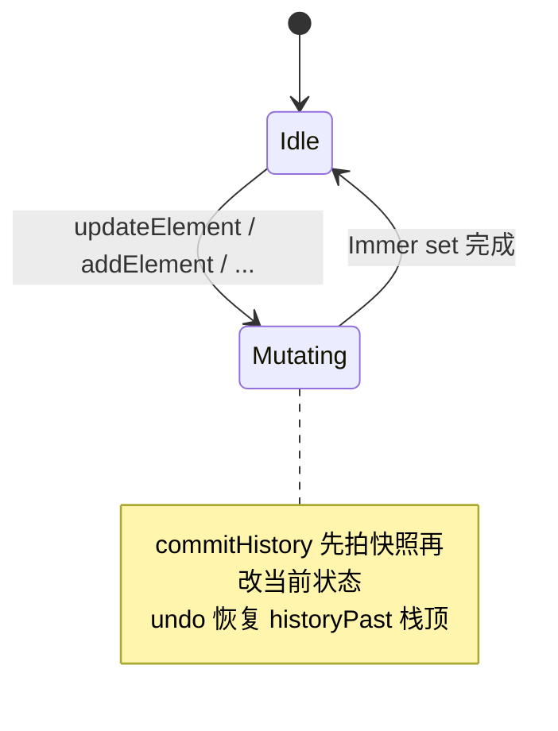

**要点**：`renamePage`、部分 UI 标志位可能 **不** 入历史；大操作前确认是否应 `commitHistory`，避免「撤销一步跳太多」。

### 5.3 自动持久化

`useEditorStore.subscribe` 在每次状态变化后将 `pages`、`activePageId`、`zoom`、`pan`、`quickToolbarConfig` 写入 `localStorage`（键名 `STORAGE_KEY`，见 `store.ts`）。**`selectedIds` 默认不落盘**（每次加载清空选择）。

---

## 6. React 组件职责

| 组件 | 与 Store 的关系 | 主要职责 |
|------|-----------------|----------|
| `App` | `useEditorStore()` 全量或按需订阅 | 布局、打开各 Modal、文件 input、导出整 Stage PNG、桥接 `stageRef` |
| `StageCanvas` | `zoom`/`pan`/`selectedIds`/元素列表等 | **唯一主舞台**；Konva 事件 → `updateElement` / `setSelectedIds`；Transformer；组合子节点坐标 |
| `FloatingToolbar` | 选中元素、`zoom`/`pan`、`marqueeSelecting`、`floatingToolbarSuppressed` | HTML 浮层；世界坐标 AABB → 屏幕定位 |
| `CropEditorModal` | `updateElement`、`clone` | 裁剪 UI；写回图片专用字段 |
| `MaskEditorModal` | `setImageAIMask` | 笔刷编辑 `aiMask.strokes` |
| `AiGenerateModal` | `getActivePage`、`selectedIds`、`addElement`、`replaceImageKeepFrame` | 组装请求、处理响应与布局 |
| `MiniMap` | 读页面与视口 | 缩略导航 |
| `LibraryPanel` | 添加预设图等 | 素材入口 |

**原则**：**可序列化状态尽量只在 Zustand**；Modal 内临时 UI 状态用 `useState`，确认时再调用 store。

---

## 7. 画布坐标系统

### 7.1 三层坐标心智模型

| 层级 | 含义 | 典型用途 |
|------|------|----------|
| **世界坐标（World）** | 与 `CanvasElement.x/y/width/height` 一致；元素逻辑布局单位 | Store、对齐、导出 JSON、浮动条 AABB 计算 |
| **舞台内容坐标** | `Stage` 子 Layer 在 **应用了 `scaleX/Y=zoom` 与 `x/y=pan`** 之后的坐标系 | Konva 内部节点 `x,y` 与 Transformer |
| **屏幕 / 客户端坐标** | 浏览器视口、`getBoundingClientRect` | 右键菜单、`FloatingToolbar` 的 `position: fixed` |

### 7.2 世界 ← 指针（StageCanvas 中的模式）

Stage 上监听指针时，将容器坐标转为世界坐标：

\[
x_{\text{world}} = \frac{x_{\text{pointer}} - pan_x}{zoom},\quad
y_{\text{world}} = \frac{y_{\text{pointer}} - pan_y}{zoom}
\]

（与代码中 `(point.x - pan.x) / zoom` 一致。）

### 7.3 Konva 与元素 `rotation`

Konva `Group` 默认变换顺序可理解为：**先平移到 `(x,y)`，再绕本地原点旋转**。因此计算元素在父坐标系下的 **轴对齐包围盒（AABB）** 时，应将 **本地四角** `(0,0),(w,0),(w,h),(0,h)` 旋转后再加上 `(x,y)`，而不是绕矩形中心旋转（除非节点建模不同）。浮动条若用错 pivot，旋转后会压在图层上。

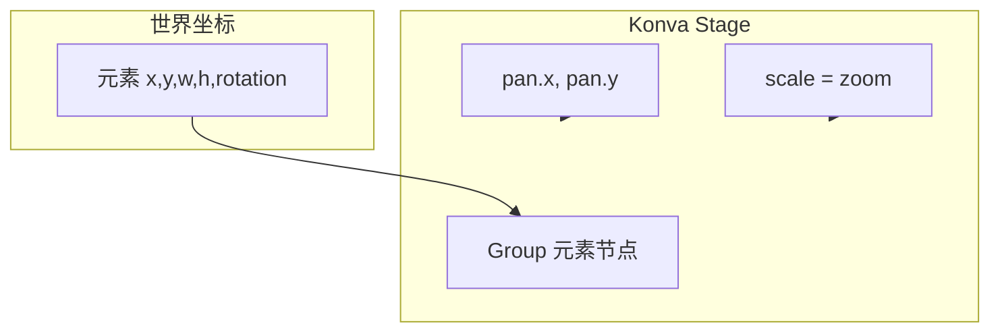

---

## 8. 图片裁剪

### 8.1 两套「旋转」不要混

| 概念 | 存储字段 | 含义 |
|------|----------|------|
| **画布上整图旋转** | `ImageElement.rotation` | 整个图层相对画布旋转 |
| **裁剪框内源图旋转** | `cropRotation` | 仅在 **裁剪编辑器 / 绘制贴图** 时，对源位图做旋转（`export.ts` 里 `ctx.rotate(cropRotation)`） |

另外还有 **`cropOffsetX/Y`**（平移源图）、**`cropScale`**（在 cover 比例基础上的额外缩放）、**`flipX`/`flipY`**。

### 8.2 与 Konva 渲染的关系

`StageCanvas` 中图片节点使用与 `exportCroppedImageAsPNG` 一致的 **中心对齐 + cropRotation + scale + drawImage** 逻辑，保证 **屏上所见 ≈ 导出逻辑**（跨域图导出可能受 CORS 限制，代码里已有提示）。

### 8.3 裁剪数据流

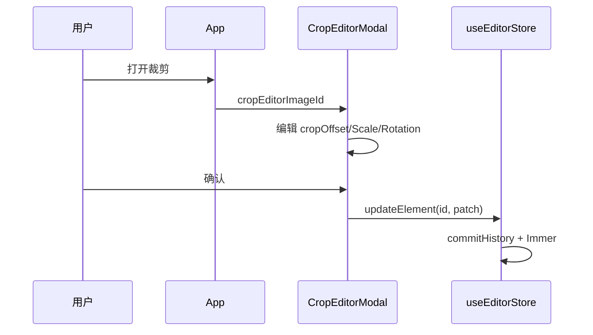

---

## 9. AI 蒙版

### 9.1 数据形态

`aiMask` 为 **矢量笔划列表** + 逻辑尺寸，而非直接存 PNG。好处：可编辑、可版本迭代；请求时再栅格化。

### 9.2 栅格化与上传

`MaskEditorModal` 在保存时组装 `ImageMaskData` → `setImageAIMask`。

`AiGenerateModal` 在请求前调用 `exportImageMaskToDataURL`（`mask.ts`）：离屏 `canvas` 上按 stroke 重放路径，**橡皮**用 `globalCompositeOperation = 'destination-out'`。

前端将 `mask` 以 **dataURL** 放入 JSON；后端 `normalize_request_images` 内 **`ensure_url` → OSS**，网关侧始终收到 **http(s) URL**。

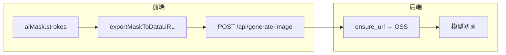

---

## 10. AI 生图调用流程

### 10.1 模式判定（前端）

| 条件 | `mode`（示意） | 行为 |
|------|------------------|------|
| 选中图 + 有 `aiMask` + 导出蒙版成功 | `inpaint` | 传 `image` + `mask` |
| 选中图、无蒙版 | `image-to-image` | 仅 `image` |
| 未选中图或非图 | `generate` | 可无图 |

### 10.2 结果落画布

| 条件 | 结果 |
|------|------|
| `outputMode === "replace-selected"` 且选中单图 **且无** 蒙版 | `replaceImageKeepFrame(id, url)`：只换 `src`，外框与蒙版形状等保留策略见 store |
| 其它 | `layoutNewAiImageBox` 计算新图 `x,y,width,height`（参考图在右侧，`NEW_AI_IMAGE_GAP`），`addElement` 新 `ImageElement` |

### 10.3 端到端时序

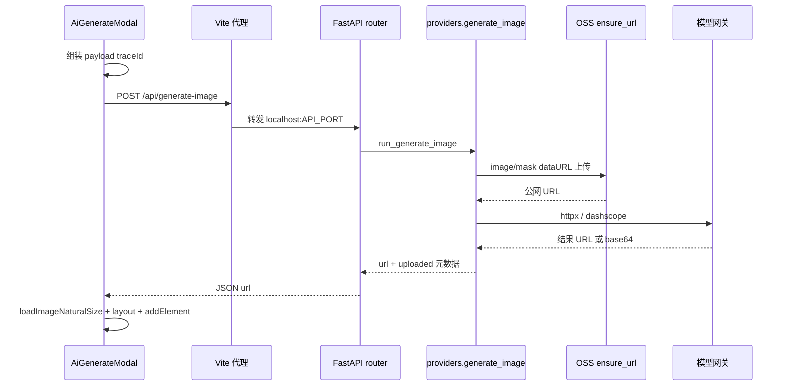

### 10.4 与后端模型表对齐

前端 `AiGenerateModal` 中的 `PROVIDERS` / `MODEL_CHOICES` 应与各 `backend/app/providers/*.py` 中的 `models` 列表及网关文档 **保持一致**，否则 UI 可选到后端不认识的 model。

---

## 11. Python 后端

### 11.1 分层

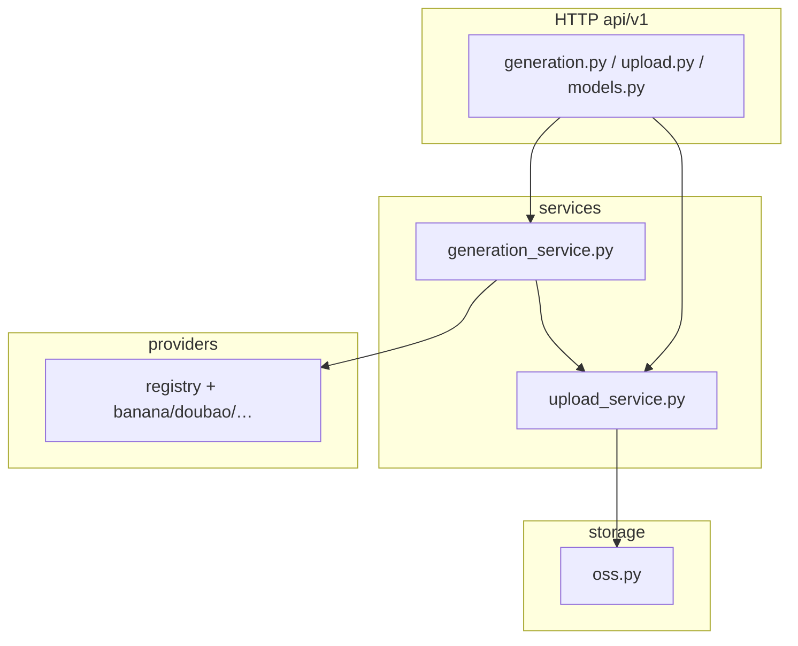

| 模块 | 职责 |
|------|------|
| `api/v1/*.py` | 参数绑定、HTTP 异常、`request_id` |
| `services/generation_service.py` | 归一化 image/mask URL、选 provider、组装 `GenerateImageResponse`、日志 |
| `services/upload_service.py` | dataURL → `storage.ensure_url` |
| `providers/*.py` | 各厂商：构建 payload、`httpx` 或 Dashscope 调用、解析 `url` |
| `utils/http.py` | `post_json_with_retry`（网络/5xx/429 重试） |
| `storage/oss.py` | 上传字节流 / dataURL |
| `middleware/request_logging.py` | 请求日志、耗时 |

### 11.2 环境变量（概念分组）

| 类别 | 示例变量 | 用途 |
|------|-----------|------|
| 网关与密钥 | `BANANA_API_KEY`、`DOUBAO_API_KEY`、`COMFLY_BASE_URL` 等 | 调用外部 API |
| OSS | `OSS_ACCESS_KEY_ID`、`OSS_SECRET`、`OSS_ENDPOINT`、`OSS_BUCKET`、`OSS_PUBLIC_BASE_URL` 等 | 上传与返回 URL |
| 服务 | `API_PORT` | 与 Vite 代理一致 |
| 调试 | `RETURN_RAW_RESPONSE` | 是否在响应中带原始上游 JSON |

具体以 `backend/app/core/settings.py`、`backend/app/storage/oss.py` 为准。

---

## 12. OSS 上传

### 12.1 `ensure_url` 行为

| 输入 | 输出 |
|------|------|
| `null` / 空 | `null` |
| `http(s)://...` | **原样返回**（认为已是网关可拉取的 URL） |
| `data:image/...;base64,...` | 解码 → 临时文件 → **PUT OSS** → 返回 `OSS_PUBLIC_BASE_URL + key` |

### 12.2 对象键与追溯

`generate_oss_object_key` 会混入 `traceId`、`api_name`（如 `source` / `mask` / `ref0`）、日期与随机散列，便于在桶内按业务追踪。

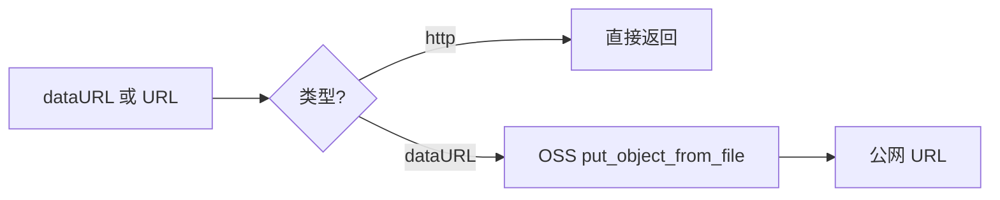

---

## 13. 保存与加载 JSON

### 13.1 三种「保存」路径

| 机制 | API | 说明 |
|------|-----|------|
| **自动** | `useEditorStore.subscribe` | 每次状态变更写 `localStorage` |
| **手动导出文件** | `exportProjectJSON` + `downloadJSON`（`export.ts`） | 用户下载 `ProjectJSON` |
| **手动选文件导入** | `readJSONFile` + `loadProjectJSON` | 校验失败时 UI alert |
| **远程** | `saveRemote(url)` / `loadRemote(url)` | `fetch` POST 完整 JSON / GET 解析；**需自备**接受/返回 `ProjectJSON` 的服务 |

### 13.2 `ProjectJSON` 与 `localStorage` 的差异

| 内容 | `ProjectJSON` 文件 | `localStorage` |
|------|-------------------|----------------|
| `pages`、`activePageId` | ✓ | ✓ |
| `zoom`、`pan` | 可选（导出函数未强制；加载时以 store 逻辑为准） | ✓ |
| `quickToolbarConfig` | 不在 `exportProjectJSON` 默认结构内 | ✓ |
| `selectedIds` | 导出时当前选择可存在快照逻辑外 | 一般不持久 |

维护时若希望「工程文件包含视口与快捷条」，需扩展 `ProjectJSON` 与 `loadProjectJSON`。

---

## 14. 典型用户操作数据流

### 14.1 移动与吸附

用户拖曳 Group → `StageCanvas` `dragBoundFunc` / `dragend` → `updateElement` 更新 `x,y`（可能合并吸附与组合子项相对位移）。

### 14.2 变换缩放

Transformer `transformend` → 将 `scaleX` 等收敛到 `width/height`（代码里对图片/矩形等有统一处理）→ `updateElement`。

### 14.3 组合

多选 → `groupSelected`：计算包围盒，新建 `group` 元素，子元素设 `parentId`。

### 14.4 AI 局部重绘闭环

选中图片 → 打开蒙版编辑 → 笔划 → 保存写入 `aiMask` → 打开生图 Modal → 带 `mask` dataURL 请求 → 后端上传 OSS → 网关 inpaint → 新图层或替换策略。

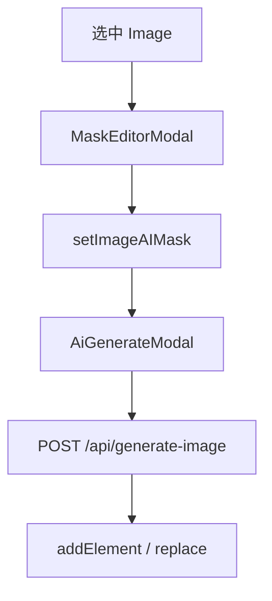

---

## 15. 容易混淆的问题

| 混淆点 | 说明 |
|--------|------|
| **元素 `rotation` vs `cropRotation`** | 前者是图层在画布上转；后者只影响「框内如何切源图」。 |
| **展示蒙版 `maskShape` vs AI 蒙版 `aiMask`** | 前者是 **clip 形状**（圆角矩形/圆）；后者是 **笔刷栅格语义**，用于 inpaint。 |
| **世界坐标 AABB vs Konva `getClientRect`** | 若自算 AABB，旋转 pivot 必须与 Konva 一致（见第 7 节）。 |
| **`parentId` 与 `group.children`** | 当前数据模型二者并存；修改组合逻辑时需保持同步，避免孤儿引用。 |
| **历史栈与 `updateElement`** | 默认每次 `updateElement` 会 `commitHistory`；高频事件（如拖拽每一帧）若在中间态也入栈会导致撤销粒度异常——当前实现依赖 Konva 层是否在 end 才写回（需阅读 `StageCanvas` 具体绑定）。 |
| **跨域图片** | `crossOrigin = anonymous` 仍可能因 CDN 策略无法 `toDataURL`；导出 PNG 会失败，需换同源或代理。 |
| **`/api` 路径** | 开发环境依赖 Vite 代理；生产部署需 **同源反向代理** 或改 `fetch` 基地址。 |
| **端口** | `vite.config.ts` 默认 `API_PORT=13555` 与 `package.json` 中 uvicorn 一致；只改一端会 502。 |

---

## 16. 如何扩展成 AI 工作流

以下按 **侵入性从低到高** 排列。

### 16.1 仅扩展「一步工具」

| 步骤 | 做法 |
|------|------|
| 新增后端能力 | 在 `schemas/generation.py` 等增加可选字段 → 扩展对应 `providers/*.py` 或注册新 provider → 必要时扩展 `generation_service` |
| 新增前端参数 | `AiGenerateModal` 表单字段并入 `payload`；与后端字段名对齐（camelCase 已在 Pydantic 用 alias 处理处留意） |

### 16.2 扩展「画布上的 AI 节点」

| 步骤 | 做法 |
|------|------|
| 新元素类型 | 在 `types.ts` 增加 `ElementType` 与联合成员；`StageCanvas` 增加渲染分支 |
| 序列化 | `ProjectJSON` 无额外字段，只要 `elements` 数组可解析即可 |
| Store | 若新类型需要专用 action，在 `store.ts` 增加方法，并考虑 `getBounds` / 对齐逻辑 |

### 16.3 多步工作流（DAG / Agent）

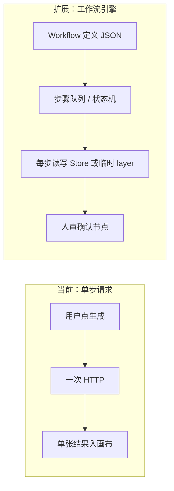

建议实践：

1. **工作流状态与编辑器状态分离**：例如 `workflowStore` 或在元素上挂 `meta.workflowStepId`，避免污染 undo 粒度。
2. **每步输入输出明确**：上一步导出「图层 ID 列表 + 参数」；下一步从 Store 读取并调用现有 `exportImageMaskToDataURL` / `exportProjectJSON` 子集。
3. **可观测性**：沿用 `traceId`（前端已 `nanoid()`），贯穿后端日志与 OSS 路径。
4. **失败重试与部分成功**：`utils/http.py` 已有 HTTP 重试范式，工作流层可包装「步骤级重试 + 用户跳过」。

### 16.4 与 Cursor / SDK 自动化结合

若将来用 **Cursor Agent** 或 **`@cursor/sdk`** 驱动本应用：优先通过 **稳定的 JSON 契约**（`ProjectJSON` + 自建「工作流描述」schema）交换，而非模拟 UI 点击；画布侧暴露「导入工程」「选中 id」「替换 src」等 **store 级 API** 最适合自动化。

---

## 附录：关键文件速查

| 主题 | 文件 |
|------|------|
| 类型定义 | `src/editor/types.ts` |
| 状态与持久化 | `src/editor/store.ts` |
| 主画布 | `src/components/StageCanvas.tsx` |
| AI 请求 | `src/components/AiGenerateModal.tsx` |
| 蒙版栅格化 | `src/editor/mask.ts` |
| 裁剪导出 | `src/editor/export.ts` |
| 后端入口 | `backend/app/main.py`（`uvicorn backend.app.main:app`） |
| 生图编排 | `backend/app/services/generation_service.py` + `backend/app/providers/` |
| OSS | `backend/app/storage/oss.py` |
| 开发代理 | `vite.config.ts` |

---

*文档版本与仓库代码同步维护；若接口或字段变更，请同时更新本文档「附录」引用的行为描述。*
