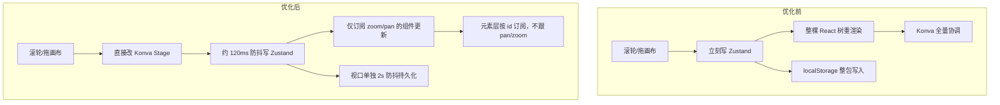

# 画布性能优化说明

> **读者**：想了解「为什么现在拖/缩放/框选更丝滑」的维护者。  
> **时间**：2026-05 前后两轮优化 + 一次无限循环修复。  
> **相关代码**：`src/components/StageCanvas.tsx`、`src/canvas/**`、`src/editor/store/**`

---

## 1. 之前为什么卡？

核心矛盾：**平移/缩放（pan/zoom）发生得非常频繁**，但旧实现里几乎每次都会：

1. 把 `zoom` / `pan` 写进 Zustand；
2. 让所有订阅了 store 的 React 组件重渲染（`StageCanvas`、每个元素、工作流节点、小地图、浮动工具栏等）；
3. 让 `react-konva` 在 reconciler 里同步更新大量 Konva 节点；
4. 顺带触发 localStorage 整包序列化（`JSON.stringify` 整个工程）。

拖拽、框选、拖工作流连线时也有类似问题：高频 `mousemove` 直接 `setState`，一帧可能触发几十次 React 更新。

---

## 2. 优化思路总览



| 类别 | 做了什么 | 体感影响 |
|------|----------|----------|
| **视口** | 滚轮/拖画布优先改 Konva，延迟写 store | 平移、缩放明显更顺 |
| **分层** | 背景 / 内容 / 交互 三层拆开 | pan/zoom 不拖垮元素与工作流节点 |
| **订阅** | 按 id 订阅、细粒度 selector、`useShallow` | 减少无效重渲染 |
| **高频事件** | `requestAnimationFrame` 合并更新 | 框选、拖连线指针更稳 |
| **Konva** | 装饰层 `listening={false}` | 减少命中检测开销 |
| **持久化** | 页面数据与视口分开防抖 | 缩放时不再疯狂写磁盘 |
| **对齐线** | 外部 runtime，不抬升 `StageCanvas` state | 拖元素时少一层父组件刷新 |
| **稳定性** | 修复 selector 每次返回新数组导致的死循环 | 应用可正常加载 |

---

## 3. 视口：命令式更新 + 延迟同步 Store

**文件**：`src/canvas/hooks/useImperativeViewport.ts`

- 滚轮缩放、空格/拖 Stage 平移时，**直接** `stage.scale()` / `stage.position()` + `batchDraw()`。
- 约 **120ms** 防抖后才把当前 scale/position 写回 `setZoom` / `setPan`（内部用 `createRafBatcher` 再合并到一帧）。
- 交互过程中 `interactingRef` 为 true 时，**忽略** store 里 pan/zoom 变化对 Stage 的回写，避免「store ↔ Stage」互相打架。

仍订阅 `zoom`/`pan` 的 UI（小地图、浮动工具栏、部分节点内文字缩放等）会在防抖后更新，但**元素层坐标在世界里不变**，配合下面按 id 订阅后，拖画布时元素组件不会跟着刷。

---

## 4. Stage 三层拆分

**文件**：

| 层 | 组件 | 职责 | 是否订阅 pan/zoom |
|----|------|------|-------------------|
| 背景 | `CanvasBackgroundLayer` | 静态网格 + 工作流边 | 否（边 `strokeScaleEnabled={false}`） |
| 内容 | `CanvasPageContent` | 画布元素 + AI 节点 + 图片工作流端口 | 否 |
| 交互 | `CanvasInteractionLayer` | 框选矩形、Transformer、临时连线 | 局部（框选/连线逻辑） |

`StageCanvas` 本身只保留少量 selector（如 `workflowConnecting.active`、`marqueeSelecting`），不再把 `zoom`/`pan` 传给每一层。

---

## 5. Zustand 订阅粒度

### 5.1 按 id 订阅单个实体

- **`ElementNode`**（`elementId`）：只在该元素对象引用变化时重渲染。
- **`WorkflowNodeView`**（`nodeId`）：只在该 AI 节点变化时重渲染。
- **`ImageElementNode`** 等：在元素 props 内再 `memo`。

父组件 `CanvasPageContent` 只订阅 **id 列表**，不持有完整 element 对象。

### 5.2 `useShallow` 与稳定空数组

**文件**：`src/editor/store/shallowEqual.ts`、`CanvasPageContent.tsx`、`GroupElementNode.tsx`

问题：selector 里 `filter().map()` 或 `?? []` **每次返回新数组**，Zustand 默认 `Object.is` 认为变了 → 在 react-konva 里会触发 `getSnapshot should be cached` 甚至无限循环。

处理：

- 无数据时返回共享的 `EMPTY_STRING_ARRAY` / `EMPTY_ELEMENTS`；
- 列表类 selector 用 `useShallow`（`zustand/react/shallow`）做浅比较；
- `CanvasInteractionLayer` 的 `page.elements` 用 **引用相等**（Immer 未改元素列表时引用不变）。

### 5.3 工作流连线指针

**`WorkflowNodeView`** 故意 **不** 订阅 `workflowConnecting.pointerX/Y`，只订阅 `active` / `dataType`。指针位置由 `CanvasInteractionLayer` + `useMarqueeSelection` 里的 RAF 批处理更新 store，避免拖线时每帧重绘所有节点。

### 5.4 其它组件

- **`App` / `MiniMap` / `FloatingToolbar`**：从「整 store」改为多个小 selector；小地图用 `requestAnimationFrame` + 比较 pan/zoom 避免重复 `setState`。
- **`FloatingToolbar`**：用 `layoutSignature` 字符串（选中元素位置尺寸）驱动位置重算，而不是任意 store 变化都布局。

---

## 6. 高频事件：RAF 批处理

**文件**：`src/canvas/utils/rafBatcher.ts`

`createRafBatcher` 把同一帧内的多次回调合并为 **最多一次**，用于：

- 视口写回 store（`useImperativeViewport`）；
- 框选 / 工作流连线 `mousemove` 更新指针（`useMarqueeSelection`）；
- （旧路径 `useCanvasPanZoom` 仍保留同类用法，主路径已切到 imperative viewport）。

---

## 7. Konva 与 React 层优化

| 手段 | 位置 | 作用 |
|------|------|------|
| `React.memo` | `ElementNode`、`ImageElementNode`、`WorkflowNodeView`、`CanvasPageContent`、`MiniMap`、`FloatingToolbar` 等 |  props 不变则跳过渲染 |
| `listening={false}` | 网格、对齐线、框选框、节点内装饰、预览图等 | 不参与命中检测，减轻事件树 |
| `perfectDrawEnabled={false}` | 网格线、对齐线 | 减少抗锯齿重绘 |
| `guidesRuntime` | `src/canvas/guides/guidesRuntime.ts` + `AlignmentGuides.tsx` | 对齐线走模块级订阅，相等时不通知，避免抬升 `StageCanvas` 的 `guides` state |

**`WorkflowNodeView`** 的 `useLayoutEffect`：仅在四舍五入后的宽高与 store 不一致时 `updateNode`，避免尺寸回写引发渲染环。

---

## 8. 持久化：页面 vs 视口分开防抖

**文件**：`src/editor/store/persistence/setupAutoPersist.ts`

| 触发 | 防抖时间 | 说明 |
|------|----------|------|
| `pages` / `activePageId` 变化 | 600ms（`LOCAL_STORAGE_PERSIST_DEBOUNCE_MS`） | 编辑内容 |
| 仅 `zoom` / `pan` 等视口变化 | **2000ms** | 避免缩放时反复 `JSON.stringify` 整包 |

---

## 9. 开发模式：关闭热更新（与性能相关）

**文件**：`start-dev.sh`、`vite.config.ts`（`DEV_NO_RELOAD=1`）

`./start-dev.sh` 使用 `dev:no-reload`：Vite 关闭 HMR、uvicorn 不加 `--reload`。  
改代码后需 **重启脚本 + 浏览器刷新**，避免 HMR 与 Konva 状态交织带来的额外卡顿或怪异重载。与运行时帧率无关，但调试大改时更稳定。

---

## 10. 改性能时建议遵守的约定

1. **不要把 `zoom`/`pan` 往下传给整层子树**；需要屏幕换算的组件自己 selector 订阅。
2. **selector 不要每次返回新数组/新对象**；用 `useShallow`、稳定空常量，或返回 store 里已有引用。
3. **高频指针移动**优先 RAF 或直接改 Konva，再考虑是否写 store。
4. **装饰图形**默认 `listening={false}`。
5. 新增列表订阅时，在 React DevTools / Profiler 里看 pan/zoom 是否仍导致全树 commit。

---

## 11. 关键文件索引

```
src/components/StageCanvas.tsx          # Stage 组装、imperative viewport 接入
src/canvas/hooks/useImperativeViewport.ts
src/canvas/utils/rafBatcher.ts
src/canvas/components/CanvasBackgroundLayer.tsx
src/canvas/components/CanvasPageContent.tsx
src/canvas/components/CanvasInteractionLayer.tsx
src/canvas/elements/ElementNode.tsx
src/canvas/guides/guidesRuntime.ts
src/canvas/hooks/useMarqueeSelection.ts
src/components/workflow/WorkflowNodeView.tsx
src/components/MiniMap.tsx
src/components/FloatingToolbar.tsx
src/editor/store/shallowEqual.ts
src/editor/store/persistence/setupAutoPersist.ts
```

---

## 12. 若以后还觉得卡，可优先排查

1. 某处仍 `useEditorStore()` 无 selector 订阅整 store。  
2. 新 selector 返回 `filter().map()` 未加 `useShallow`。  
3. 工作流节点内又订阅了高频字段（指针、进度条 tick 等）却未做节流。  
4. 单页元素/边数量极大时，考虑虚拟化或 Canvas 离屏层（当前未做）。  
5. Chrome Performance：看 `batchDraw`、Reconciler commit 是否随 pan/zoom 线性增长。

---

*维护手册总索引见 `docs/MAINTENANCE_GUIDE.md`。*
